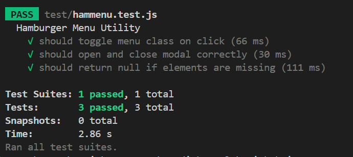

# ✅ Test Plan & Evaluation

## 📌 User Stories Covered

### 🧩 User Story 1 – Hamburger Menu Toggle

> As a user, I want to click a hamburger menu to show or hide the navigation menu.

### 🧩 User Story 2 – Modal Open/Close

> As a user, I want to open and close a modal window so I can interact with dynamic content.

---

## 🧪 Test Plan & V-Model Mapping

These user stories are linked to different testing layers of the V-model:

- **Unit tests** target the *component level*, verifying small isolated functions like toggling or displaying elements.
- **System tests** correspond to the *system level*, testing full scenarios from a user’s point of view.

Each user story has tests for both expected behavior (happy path) and error handling (unhappy path).

### 🧪 System Tests Overview

| User Story | Scenario         | ✅ Happy Path (Expected Behavior)                       | ❌ Unhappy Path (Error Handling)                       |
| ---------- | ---------------- | ------------------------------------------------------ | ----------------------------------------------------- |
| 1          | Toggle menu      | Menu toggles visibility when clicked (`.active` class) | Missing element logs error, function exits gracefully |
| 2          | Modal open/close | Modal shows/hides via `display: block`/`none`          | Missing modal/button logs error without crashing      |

### 🔬 Unit Tests Overview

#### User Story 1 – Hamburger Menu

- `toggleMenu()` correctly toggles the `.active` class.
- If the button or menu is missing, it logs an error and skips execution.

#### User Story 2 – Modal Handling

- `openModal()` sets `modal.style.display = 'block'`.
- `closeModal()` sets `modal.style.display = 'none'`.
- Missing DOM elements are handled gracefully.

We use lightweight DOM mocks (via `document.createElement`) to simulate the environment without relying on real UI components.

---

## 🖼️ Test Results

Here’s a screenshot of all tests passing:

---

## ⚙️ Test Automation with GitHub Actions

Tests are automatically triggered whenever changes are pushed to the repository.  
The CI pipeline is configured using [GitHub Actions](https://github.com/features/actions). The workflow file is located at:

This ensures tests are always up to date and run in a clean environment.

---

## 🧠 Evaluation & Reflection

### ✅ What errors can we catch?

- If a DOM element like the modal or menu button is missing, we’ll catch it with a clean console error.
- JavaScript logic bugs such as class toggling or incorrect display state.

### ❌ What we *can’t* catch with current tests:

- Visual/UI issues (z-index conflicts, animation timing, misplaced buttons)
- Responsive behavior on different screen sizes
- Accessibility violations

### 🧾 So… does everything work?

From a logic perspective, yes. The behavior of opening, closing, and toggling works consistently and error handling is in place.

However, since we’re not testing CSS, visuals, or real user interaction flow, we can’t claim full confidence across browsers or devices.

### 🔧 What could be improved?

- Introduce visual regression testing (e.g., Percy or Playwright screenshots)
- Consider end-to-end testing for full user flow
- More complex DOM factories for simulating mobile views or large screens

---

**Conclusion:**  
The core JavaScript logic is solid and well-tested. There's clear error handling and automated testing in place. Visual and cross-device checks should follow in future iterations.
