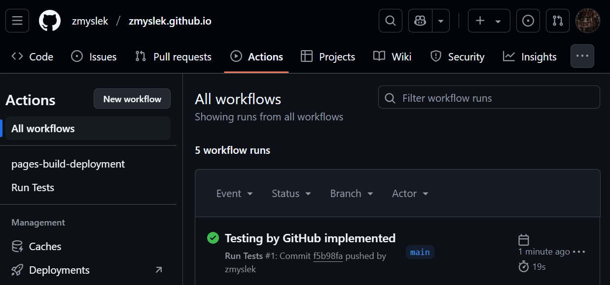

# ✅ Test Plan & Evaluation

## 📌 User Stories Covered

### 🧩 User Story 1 – Hamburger Menu Toggle

> As a user, I want to click a hamburger menu to show or hide the navigation menu.

### 🧩 User Story 2 – Modal Open/Close

> As a user, I want to open and close a modal window so I can interact with dynamic content.

---

## 🧪 Test Plan & V-Model Mapping

The following test strategy is based on the V-model software development process.

- **Unit Tests** (Component Level): Validate specific functions like `toggleMenu()` and `openModal()`.
- **System Tests** (System Level): Validate the full user story through interactions and expected outcomes.

Each user story includes:

- A *happy path*: normal, expected behavior
- An *unhappy path*: error or edge case scenario

---

## 🧪 System Tests Overview

| User Story | Scenario         | ✅ Happy Path (Expected Behavior)                       | ❌ Unhappy Path (Error Handling)                       |
| ---------- | ---------------- | ------------------------------------------------------ | ----------------------------------------------------- |
| 1          | Toggle menu      | Menu toggles visibility when clicked (`.active` class) | Missing element logs error, function exits gracefully |
| 2          | Modal open/close | Modal shows/hides via `display: block`/`none`          | Missing modal/button logs error without crashing      |

---

## 🔬 Unit Tests Overview

### 🧩 User Story 1 – Hamburger Menu

- `toggleMenu()` correctly toggles the `.active` class.
- If the button or menu is missing, it logs an error and skips execution.

### 🧩 User Story 2 – Modal Handling

- `openModal()` sets `modal.style.display = 'block'`.
- `closeModal()` sets `modal.style.display = 'none'`.
- Missing DOM elements are handled gracefully.

We use mocked DOM elements (`document.createElement`) to simulate the environment, serving as lightweight *factories* for testing.

---

## 🖼️ Test Results

Here’s a screenshot of all tests passing:

---

## ⚙️ Test Automation with GitHub Actions

Tests are automatically run whenever code is pushed to the GitHub repository.

### 🛠️ Workflow file location:
./github/workflows/test.yml

### 💡 Technologies used:

- Node.js
- Vitest / Jest (for JavaScript unit tests)

You can view the test run results directly on GitHub (see instructions below).

---

## 🧠 Evaluation & Reflection

### ✅ What errors can we detect?

- Missing elements in the DOM are caught with helpful console errors.
- Logic bugs like incorrect toggle state or missing display assignment.

### ❌ What we can’t detect (limitations):

- Visual/CSS bugs (e.g., display hidden by `z-index`, animations not showing)
- Screen responsiveness issues
- Accessibility problems (screen readers, keyboard navigation)

---

### 📈 Is “everything working”?

**✔️ Yes — for logic.**
- All functions work correctly and errors are handled.

**❗ No — for visuals and UI behavior.**
- We are not testing CSS, layout, or rendering across devices or browsers.

---

## 🔧 Suggested Improvements

- Add visual regression testing (e.g., Percy, Playwright with screenshot diffs)
- Write end-to-end tests using tools like Cypress
- Extend factory mocks to test more responsive states (mobile/desktop)

---

## ✅ Conclusion

The test coverage for JavaScript logic is thorough and automated. There is a clear link to the V-model, and both positive and negative paths are tested. Visual behavior still requires manual or advanced visual testing tools.
